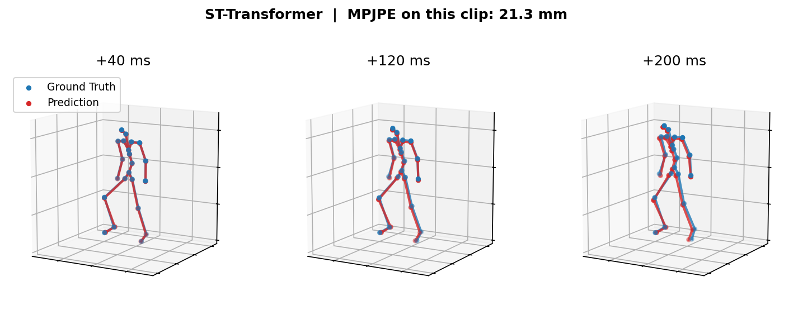
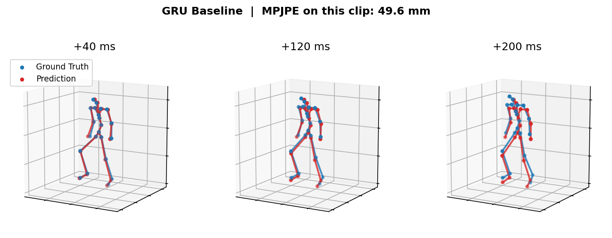

# Human Motion Prediction with Spatio-Temporal Transformers

This repository contains code for short-horizon human motion prediction using PyTorch.  
The models are trained and evaluated on the AMASS dataset.

---

## What this project does

Given a short sequence of past human motion, the model predicts a few future frames.

- Past input: 25 frames (1 second)
- Future prediction: 5 frames (200 ms)
- Output: joint rotations + root translation

The main goal is to compare a transformer-based model with a GRU baseline under the same setup.

---

## Models

### Spatio-Temporal Transformer

- Transformer model with temporal and spatial attention, run in parallel in each block
- Temporal attention is applied per joint
- Spatial attention is constrained using the SMPL skeleton
- Uses 6D rotation representation
- Predicts each frame as an offset from the previous pose, autoregressively

### GRU Baseline

- GRU encoder over the input sequence
- Separate decoders for pose and root translation
- Predicts all 5 future frames at once
- Uses the same data representation and loss as the transformer

---
## Experimental Setup

- Dataset: AMASS (CMU, KIT, Transitions), resampled to 25 FPS
- Splits: 70 / 15 / 15, with no subject shared between splits
- Input frames: 25
- Output frames: 5
- Joints: 22 (SMPL)
- Training epochs: 20 for both models
- Metrics: MPJPE (mm) at each future frame, computed with forward kinematics on each subject's SMPL skeleton

Both models use the same data, prediction horizon and optimization settings. They differ only in how they decode future frames.

Two simple baselines are included for reference: repeating the last frame, and continuing the last frame's velocity.

---

## Results

Test split, MPJPE (mm) at each prediction horizon. The 200 ms column is also the FDE.

| Model             | 40 ms | 80 ms | 120 ms | 160 ms | 200 ms | Avg   |
|-------------------|-------|-------|--------|--------|--------|-------|
| Repeat last frame | 12.3  | 24.4  | 36.3   | 47.9   | 59.1   | 36.0  |
| Constant velocity | 2.7   | 7.6   | 14.1   | 22.0   | 30.9   | 15.5  |
| GRU Baseline      | 29.9  | 31.2  | 34.8   | 39.9   | 45.7   | 36.3  |
| ST-Transformer    | 4.5   | 9.2   | 14.2   | 19.5   | 25.0   | 14.5  |

Constant velocity is best up to 80 ms. The ST-Transformer pulls ahead after about 120 ms and is 19% better at 200 ms.  
The GRU does not have a residual connection to the last input pose, which likely explains its high error at 40 ms.

## Acknowledgments 
- AMASS dataset for motion capture data
- SMPL body model for skeletal representation
- This project was inspired by the Motion Transformer work from ETH Zurich:
  https://ait.ethz.ch/motiontransformer
